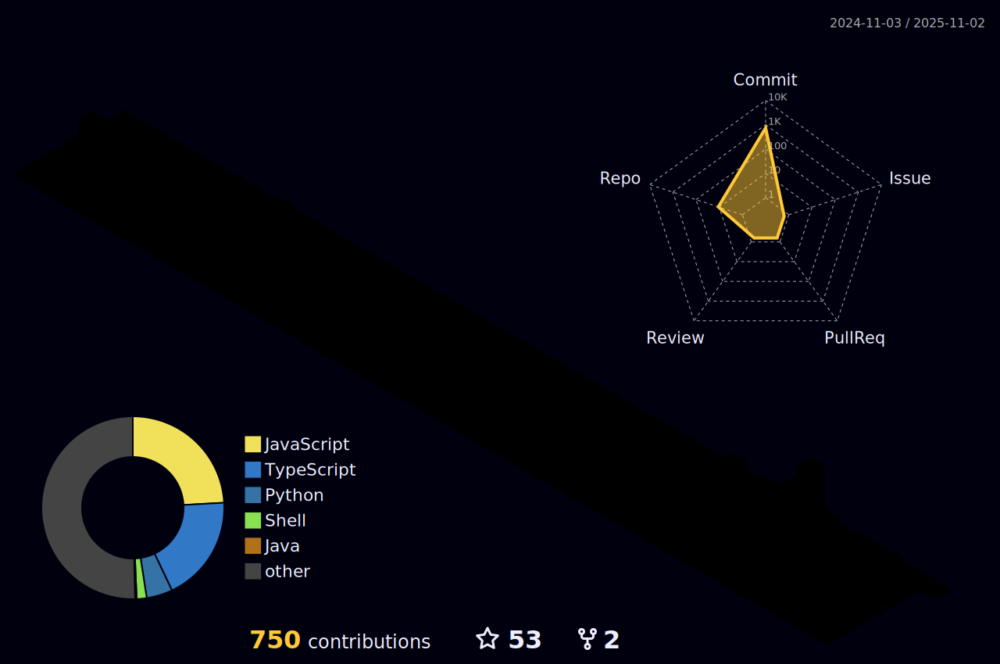

<h3>⚔️SKILLS</h3>

|title|tags|
|:---:|----------------|
|<h4 align="left">Languages</h4>|

|
|<h4 align="left">Backend</h4>|

|
|<h4 align="left">Database</h4>|

|
|<h4 align="left">Data Visualization</h4>|

|
|<h4 align="left">Devops</h4>|

|
|<h4 align="left">Testing</h4>|

|

